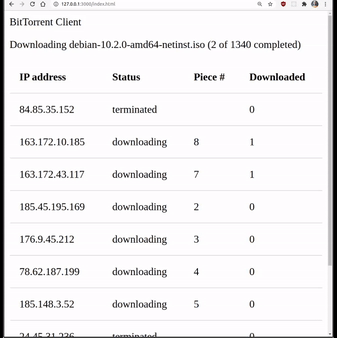
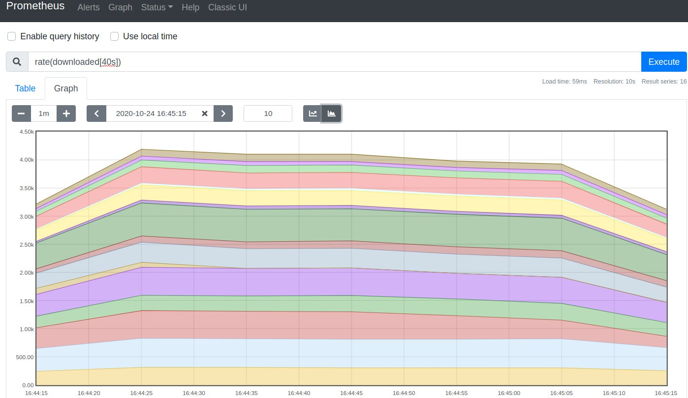

# torrent_client

A concurrent bit torrent downloader written in Crystal!

## Background and design
This application is a [Crystal](https://crystal-lang.org) port of Jesse Li's [golang client](https://github.com/veggiedefender/torrent-client/). I recommend Jesse's companion [article](https://blog.jse.li/posts/torrent/) on how bit torrent works, which served as an inspiration for this project.

This project is meant for didactic purposes, and aims to illustrate differences in design choices and performance between Crystal and Go. The client can only download files, at the moment, but I'm planning on extending the functionality to support uploads, too.


## Installation
```
shards install # install dependencies
crystal build -Dpreview_mt src/torrent_client.cr # compile with multi-threading support
```

## Usage
```
CRYSTAL_WORKERS=<n-workers>  ./torrent_client <torrent_path> [options]

Options:

  -r, --replay                     Will replay events from the previous run. [type:Bool] [default:false]
  -o <destination_path>, --output=<destination_path>
                                    Download destination [type:String]
  -m <minimal|ncurses|web>, --mode=<minimal|ncurses|web>
                                    UI mode [type:String] [default:"minimal"]
  --help                           Show this help.

Arguments:

  01. torrent_path      The torrent file you want to download. [type:String]
```

#### Examples
```
CRYSTAL_WORKERS=8  ./torrent_client ./spec/testdata/debian.iso.torrent -o ./data/debian.iso
# sample output
Downloading debian-10.2.0-amd64-netinst.iso: 2 pieces of 1340 completed (8 peers)
```

```
CRYSTAL_WORKERS=8  ./torrent_client ./spec/testdata/debian.iso.torrent -m web
```


```
CRYSTAL_WORKERS=8  ./torrent_client ./spec/testdata/debian.iso.torrent -m ncurses
# sample output
Downloading debian-10.2.0-amd64-netinst.iso: 8 pieces of 1340 completed (9 peers)
┌────────────────┬─────────────┬───────┬────────────┐
│ Peer           │ Status      │ Piece │ Downloaded │
├────────────────┼─────────────┼───────┼────────────┤
│ 163.172.10.185 │ downloading │ 15    │ 2          │
│ 163.172.43.117 │ finished    │ 7     │ 2          │
│ 185.45.195.169 │ downloading │ 10    │ 1          │
│ 176.9.45.212   │ downloading │ 12    │ 1          │
│ 78.62.187.199  │ downloading │ 4     │ 0          │
│ 185.148.3.52   │ downloading │ 13    │ 1          │
│ 84.2.20.22     │ downloading │ 14    │ 1          │
│ 91.239.69.64   │ downloading │ 9     │ 0          │
│ 203.220.135.51 │ downloading │ 11    │ 0          │
└────────────────┴─────────────┴───────┴────────────┘
```

#### Prometheus integration

The application exposes prometheus metrics at `localhost:5000/metrics`. See the [crometheus](https://github.com/Darwinnn/crometheus) documentation for further information.

## Development
#### Replaying
To make local testing of UI and metrics collection simpler, you can start by downloading a file, e.g.
```
crystal src/torrent_client.cr ./spec/testdata/debian-10.2.0-amd64-netinst.iso.torrent
```
and then _replay_ the download on the following runs.
```
crystal src/torrent_client.cr --replay
```
A replay does not initiate any connection to peers, but simply replays the events stored in `history.log` - you'll see this file popping up in the project root folder after the first download.

#### Running the specs
```
crystal specs
```

## Contributing

1. Fork it (<https://github.com/lbarasti/torrent_client/fork>)
2. Create your feature branch (`git checkout -b my-new-feature`)
3. Commit your changes (`git commit -am 'Add some feature'`)
4. Push to the branch (`git push origin my-new-feature`)
5. Create a new Pull Request

## Contributors

- [lbarasti](https://github.com/lbarasti) - creator and maintainer
